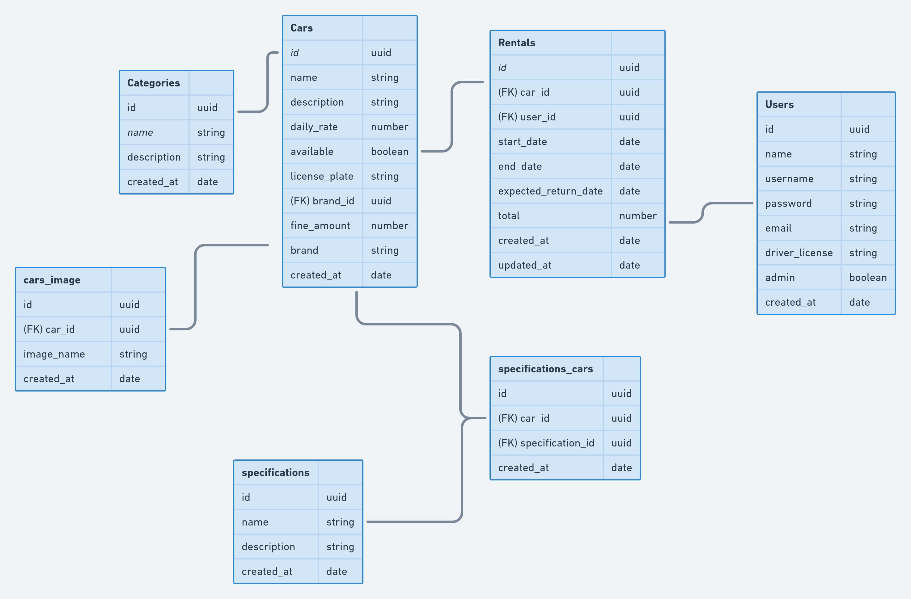

# RENTLX
A car rental service API build with Node Js.

## TypeScript

## Environemnt Configuration

### Prettier and ESLint

* [ESLint + Prettier, a dupla perfeita para produtividade e padronização de código.](https://medium.com/cwi-software/eslint-prettier-a-dupla-perfeita-para-produtividade-e-padroniza%C3%A7%C3%A3o-de-c%C3%B3digo-6a7730cfa358)

## SOLID

## Class Architecture
